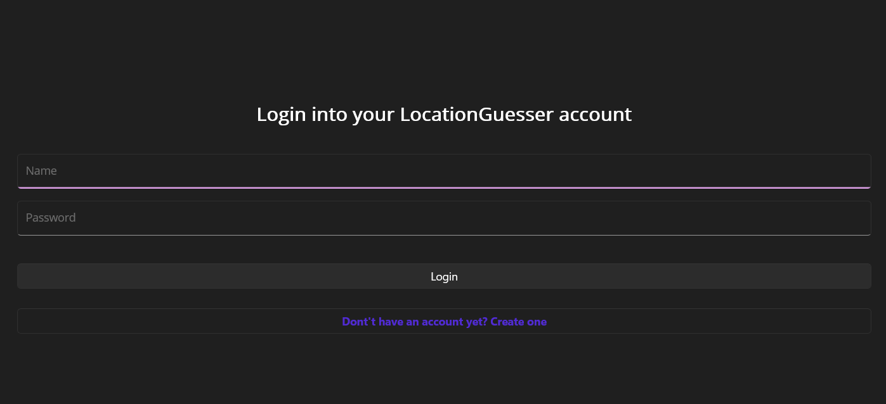
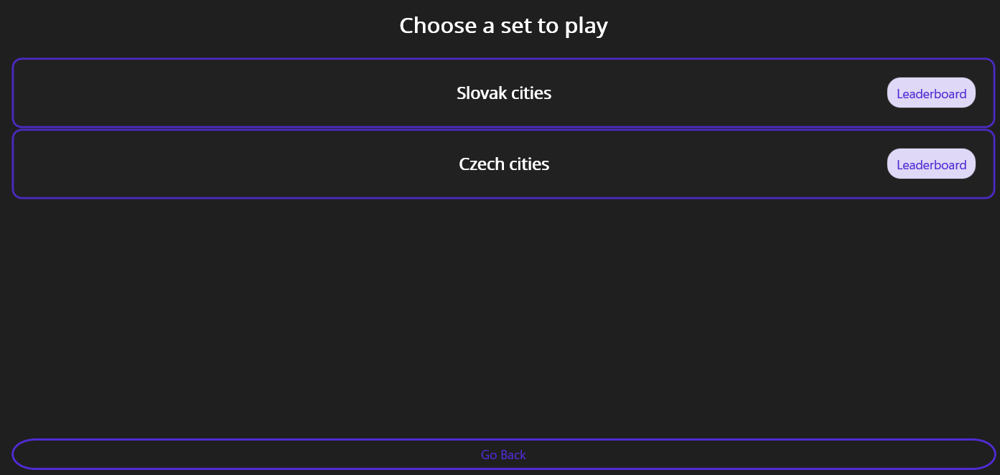
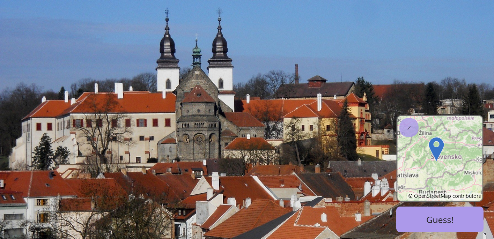
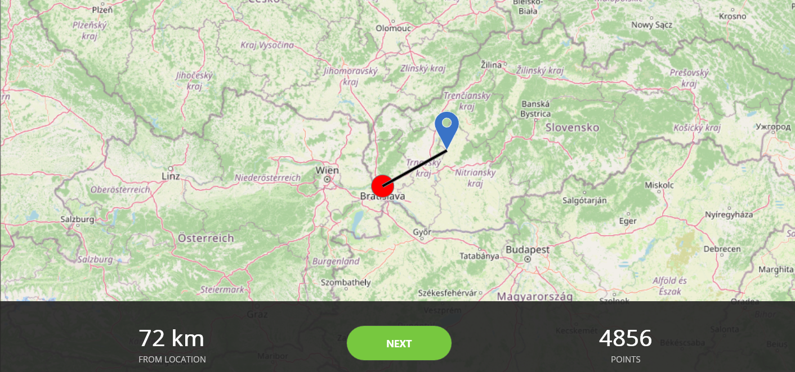
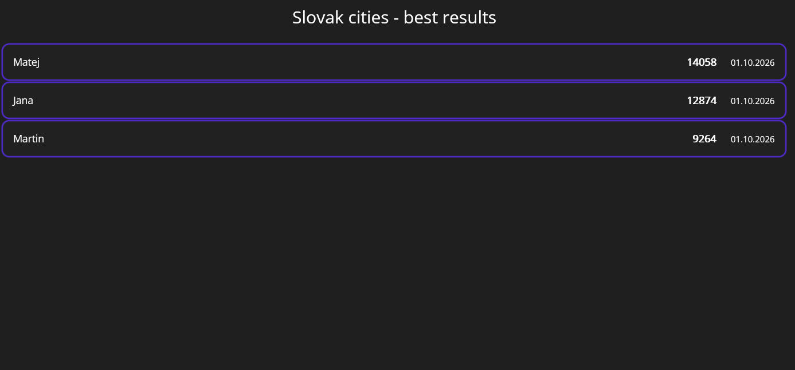

# Location Guesser

A .NET MAUI application where users guess locations on a map based on a displayed image. 
It made was as a project for the 'PB178 - Introduction to Development in C#/.NET course' at the Faculty of Informatics of Masaryk University. 

## Tech Stack

The project was written in C# using the .NET MAUI framework

## Screenshots

<table>
  <tr>
    <td align="center"><b>Login Page</b></td>
    <td align="center"><b>List Select Page</b></td>
    <td align="center"><b>Round Page</b></td>
  </tr>
  <tr>
    <td align="center"></td>
    <td align="center"></td>
    <td align="center"></td>
  </tr>
  <tr>
    <td align="center"><b>Distance Reveal</b></td>
    <td align="center"><b>Leaderboard</b></td>
    <td align="center"></td>
  </tr>
  <tr>
    <td align="center"></td>
    <td align="center"></td>
    <td align="center"></td>
  </tr>
</table>

## Requirements
* **Internet Connection (Wi-Fi/Data):** The app downloads some images for the puzzles directly from the internet; a connection is required for proper functionality.
* **Windows 10 OS or newer**
* **.NET 10.0 or newer**
* **Visual Studio 2022 or newer**

## How to Run

### Windows (Visual Studio)
1. Clone the repository
2. Open the solution (`LocationGuesser.sln`) in Visual Studio.
3. In Solution Explorer, right-click the **LocationGuesser** project (not DAL) and select **"Set as Startup Project"**.
4. Select Windows Machine target platform
5. Run the app by pressing `F5` or the *Run* button.

## AI usage
* Some boilerplate code required for the integration and setup of the **Mapsui** library was generated using Google Gemini.
